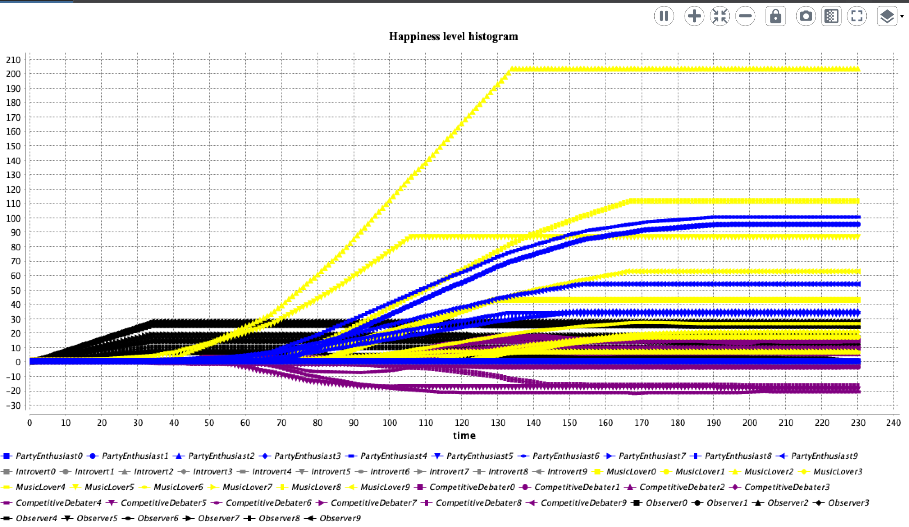
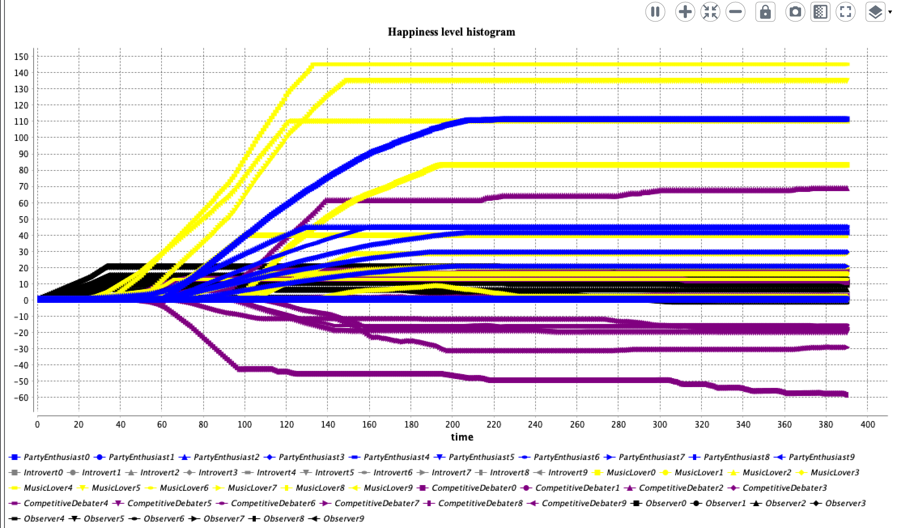

# ID2209 - Final Project

## Authors
- **Kevin Pascal**  
  *kpascal@kth.se*  
- **Emile Le Gallic**  
  *ejflg@kth.se*  

## Overview
This simulation models 50 agents, each representing a guest type, across a park, bar, and concert. Guests fall into five categories—**Party Enthusiasts**, **Introverts**, **Music Lovers**, **Competitive Debaters**, and **Observers**—each with distinct preferences and behaviors influencing decisions and happiness. The simulation tracks guest movements, interactions, and responses to boredom, happiness, and mental strength. Guests change locations based on boredom, and interactions affect happiness levels. Real-time visualizations and a happiness histogram reveal trends, offering insights into how personality traits and social settings shape experiences.

---

## Key Components

### Global Settings
- **Agents**: 50 agents divided into 5 roles:
  - **Party Enthusiasts**: Prefer the Bar.
  - **Introverts**: Prefer the Park.
  - **Music Lovers**: Thrive in the Concert.
  - **Competitive Debaters**: Enjoy debates.
  - **Observers**: Observe surroundings in the Park or Concert.
  
- **Locations**: The simulation includes:
  - **Park**: A quiet, natural environment for Introverts and Observers.
  - **Bar**: A lively space for Party Enthusiasts.
  - **Concert**: A vibrant setting for Music Lovers.

### Guest Attributes
- **Happiness**: Current happiness level (0.0 to 1.0).
- **Mental Strength**: Determines happiness gains/losses (0.0 to 1.0).
- **Nastiness**: Influences negative interactions (0.0 to 1.0).
- **Boredom**: Current boredom (0.01 to 0.2).
- **Preference Weights**: Likelihood of choosing a specific location.
- **Current Place Boredom**: Tracks boredom at the current location.

### Guest Behavior
- **Movement**: Guests move based on boredom and location preferences.
- **Boredom**: Triggers relocation when exceeding a threshold.
- **Interactions**: Affect happiness based on compatibility and location.

---

## Guest Interactions

### Party Enthusiasts
- **Preferred Location**: Bar  
- **Positive Interactions**: Socializing with Party Enthusiasts or Music Lovers.  
- **Negative Interactions**: Debates with Competitive Debaters.

### Introverts
- **Preferred Location**: Park  
- **Positive Interactions**: Time with Introverts or Observers.  
- **Negative Interactions**: Crowds or debates.

### Music Lovers
- **Preferred Location**: Concert  
- **Positive Interactions**: Socializing with Music Lovers or Party Enthusiasts.  
- **Negative Interactions**: Absence of compatible guests.

### Competitive Debaters
- **Preferred Location**: Mixed venues  
- **Positive Interactions**: Debates with other Debaters or Music Lovers.  
- **Negative Interactions**: Guests uninterested in debates.

### Observers
- **Preferred Location**: Park or Concert  
- **Positive Interactions**: Observing or socializing with Introverts.  
- **Negative Interactions**: Overcrowding or debates.

---

## Locations

### Park
A calm and natural environment ideal for Introverts and Observers. Competitive Debaters and Party Enthusiasts may find it less engaging.

### Bar
A lively social environment perfect for Party Enthusiasts. Introverts and Observers may feel overwhelmed.

### Concert
A vibrant setting for Music Lovers. Interactions with compatible guests are key to maximizing happiness.

---

## Reflexes & Behavioral Reactions

### Key Reflexes
1. **Reading Messages**: Guests respond to social stimuli.  
2. **Accepting or Declining Drink Offers**: Based on personality traits.  
3. **Changing Location**: Triggered by boredom or happiness levels.  
4. **Social Engagements**: Interactions impact happiness based on compatibility.  
5. **Wandering**: Passive behavior when no stimuli are present.

---

## Experiment & Output

### Graphical Display
A real-time visualization shows guest locations, movements, and interactions.

### Happiness Level Histogram
A histogram tracks happiness levels over time, offering insights into how personality traits and social settings impact well-being.

### Behavioral Patterns
Logs detail interactions, location changes, and happiness fluctuations, providing insights into guest behavior.

---

## Result Analysis

### Happiness Graphs
Below are two happiness graphs from the simulation:

  
*Figure 1: Happiness Graph - Simulation 1*

  
*Figure 2: Happiness Graph - Simulation 2*

### Analysis
- **Music Lovers**: Thrived in music-focused, social environments, particularly in the Concert and Bar. Positive reinforcement from compatible guests led to sustained happiness.  
- **Competitive Debaters**: Experienced fluctuating happiness due to limited engagement opportunities. Their reliance on debates and intellectual stimulation often led to periods of low happiness when encountering incompatible guests.

### Conclusion
The simulation highlights the importance of aligning environments and social interactions with guest preferences. Music Lovers thrived in tailored settings, while Competitive Debaters faced challenges due to fewer compatible interactions.

---

